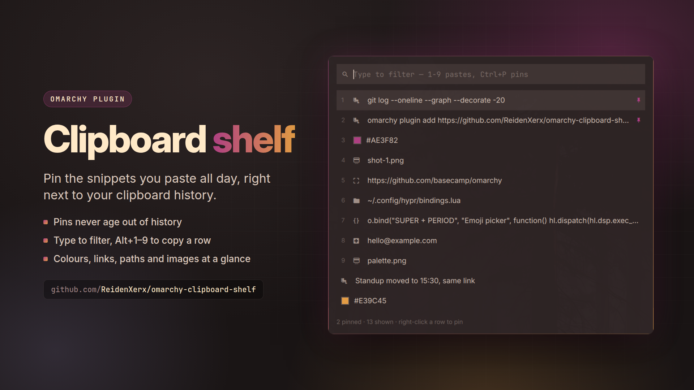

# Clipboard shelf



An [Omarchy](https://omarchy.org) bar widget that **pins the snippets you paste all day**
and keeps them one keystroke away, alongside your clipboard history.

Omarchy's built-in clipboard is a search-only overlay: everything ages out of it, so the
command you paste ten times a day is buried under the ten things you copied since. The
shelf adds a place to keep things — and a bar slot, type-aware rows, and a preview for
images.


## Install

```bash
omarchy plugin add https://github.com/ReidenXerx/omarchy-clipboard-shelf.git --enable
```

Optionally add its entries to the Omarchy menu:

```bash
~/.config/omarchy/plugins/reidenxerx.clipboard-shelf/bin/clip-shelf-menu-install
```

Requires `wl-copy` / `wl-paste` (Omarchy default set) and the built-in `omarchy.clipboard`
service left enabled — see below.

## Use

| action | result |
|---|---|
| click the bar icon | open the shelf |
| type | filter |
| `↑` `↓` | move |
| `Enter` | copy the selected entry |
| `Alt` + `1`–`9` | copy that row straight away |
| `Ctrl` + `P` | pin or unpin the selected entry |
| right-click a row | pin or unpin it |
| hover an image row | preview it, floated to the left |
| `Esc` | close |

`Alt`+digit rather than a bare digit, because the search box has to stay typeable — a bare
`1` should filter for "1", not paste something.

Pinned entries sit at the top and never age out. They live in
`~/.config/omarchy/clipboard-shelf.json` — plain JSON, hand-editable, re-read every time
the shelf opens.

## It captures nothing

The shelf reads Omarchy's own history at
`~/.local/state/omarchy/clipboard-history.json` and never starts a watcher of its own.
`omarchy.clipboard` already runs two persistent `wl-paste --watch` processes, so a second
set would mean double capture for no gain. Two consequences worth knowing:

- **Leave `omarchy.clipboard` enabled.** Disable it and history stops being recorded, so
  the shelf shows only your pins. Pins keep working.
- **Password managers are already filtered.** That capture skips entries marked
  `x-kde-passwordManagerHint` or copied while `CLIPBOARD_STATE=sensitive`, so those never
  reach the history the shelf reads.

## Rows tell you what they hold

Each row is marked for its kind — link, colour, path, email, code, image — and a colour
renders a swatch of itself rather than a glyph. Handy when you are hunting the hex you
copied out of a theme file three minutes ago.

## From the command line

```bash
clip-shelf list                # pinned snippets
clip-shelf pin "ssh alien-win" # pin some text
clip-shelf pin --stdin < file  # pin text from stdin
clip-shelf pin --clipboard     # pin whatever text is on the clipboard
clip-shelf copy 2              # put pin 2 back on the clipboard
clip-shelf unpin 2
clip-shelf clear
```

`pin "<text>"` puts the text in that command's arguments, where other processes can see
it. For anything private use `pin --clipboard` or `pin --stdin`.

## Menu entries

A plugin cannot register menu routes itself — Omarchy builds its menu from its own file
plus one user file. Opt in with:

```bash
bin/clip-shelf-menu-install          # add them
bin/clip-shelf-menu-install remove   # take them out
bin/clip-shelf-menu-install print    # just show the snippet
```

It writes only between its own marker comments in
`~/.config/omarchy/extensions/omarchy-menu.jsonc`, leaves the rest of that file byte for
byte, is safe to re-run, and puts the previous content back (held in memory, never in a
side file) rather than leaving the file unparseable — a malformed menu file silently
disables **every** user entry.

## Security

- **Copy by reference.** The panel never holds or passes clipboard content. It names an
  entry by its index and a fingerprint (the first 16 hex digits of a SHA-256 of its text
  or path). `clip-shelf` re-reads the entry from disk, checks the fingerprint so a history
  change between opening and clicking cannot copy the wrong thing, and pipes the data to
  `wl-copy` on stdin. Pin and unpin work the same way. No clipboard text or pins document
  is ever put in a process's arguments, and no shell is involved anywhere.
- **Absolute, trusted tools.** The panel starts `/usr/bin/python3` with the helper's full
  path. The helper runs `wl-copy`, `wl-paste` and `timeout` only from root-owned
  `/usr/bin`, with `PATH=/usr/bin`, a deadline and an output cap (`wl-paste`: 5 s, 1 MB).
  Every process the panel starts has a watchdog that stops it if it overruns.
- **Bounded reads.** History is read with an 8 MB cap and pins with a 256 KB cap. Both are
  JSON-limited in depth, item count and string length. The panel receives at most 200
  history entries and 100 pins, with at most 2 KB of display text each.
- **Images.** An image is used only if it is a single file directly inside
  `~/.local/state/omarchy/clipboard-images/` with a png/jpg/jpeg/webp/gif/bmp extension,
  is a regular file you own reached without symlinks, is at most 32 MB, and has a header
  that matches its extension. For the hover preview the dimensions must also be within
  16384 px per side and 40 MP. The panel then shows a verified copy from
  `$XDG_RUNTIME_DIR/reidenxerx.clipboard-shelf/` (at most 4 kept), decoded at card size.
- **Safe writes.** Pins are written through a random `O_EXCL` temporary file, fsynced and
  renamed. A symlinked or foreign destination is refused. A pins file that fails to load
  is never overwritten. `pin --clipboard` refuses content marked
  `x-kde-passwordManagerHint`.

All file, process and JSON handling goes through `bin/plugin_safety.py`. Tests:
`python3 tests/clip_shelf_test.py` and `node tests/shelf_model_test.js`.

## Remove

```bash
bin/clip-shelf-menu-install remove
omarchy plugin remove reidenxerx.clipboard-shelf
```

Pins stay in `~/.config/omarchy/clipboard-shelf.json`; delete it if you want them gone.
Preview copies live in `$XDG_RUNTIME_DIR/reidenxerx.clipboard-shelf/` and vanish at logout.
Nothing else is left behind — the shelf owns no daemon and no capture process.

## License

MIT
